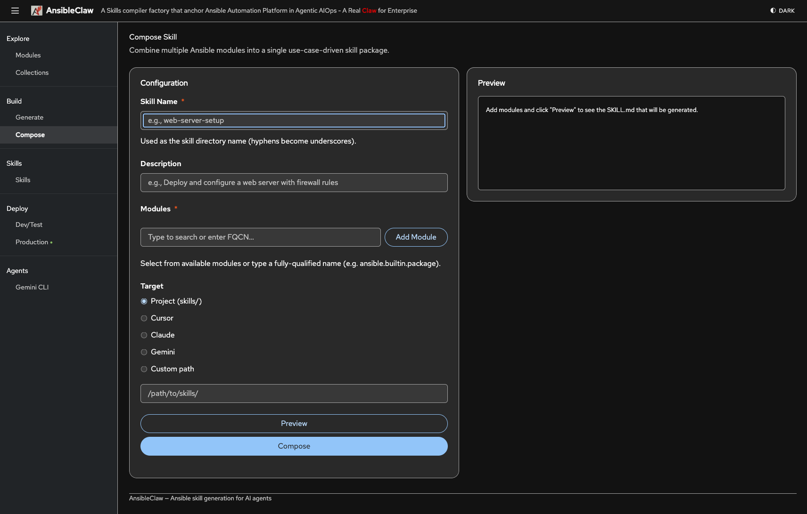

# AnsibleClaw

A skill generation framework that converts Ansible modules into portable AI agent skill packages.

## Overview

AnsibleClaw bridges Ansible's 3000+ modules to AI agents (Cursor, Claude Code, Gemini CLI, etc.) by generating full skill packages from `ansible-doc` documentation. Each package includes a SKILL.md, wrapper scripts, prerequisite checks, and a ready-to-use playbook, with **dual-mode** guidance: local **`ansible` CLI** and optional **Ansible Automation Platform (AAP)** through `scripts/aap_run.py`. You do not need the `ansible-claw` package where Ansible runs; use `ansible-core` for CLI mode and Python 3 plus AAP API access for Controller-backed execution.

**Build-time** -- Run `ansibleclaw` to resolve Ansible module documentation (via `ansible-doc`, with Galaxy fallback when the collection is not installed locally) and emit full skill packages. If AAP is configured (environment variables or `.ansibleclaw.yml`), generation can embed Controller defaults (URL, inventory, credential, project, organization) into the skill; **bearer tokens are never baked in**.

**Runtime** -- Generated skills teach agents **CLI mode** (standard `ansible` / playbook workflows; `ansible-core` on the control node) and **AAP mode** (launch ad-hoc commands and job templates via `scripts/aap_run.py` using `AAP_CONTROLLER_URL` and `AAP_CONTROLLER_TOKEN`). See [AAP Integration](#aap-integration-production-execution) below for variables and examples.

## Web Dashboard

Start with `ansibleclaw ui` and open `http://localhost:8600`. The dashboard features a collapsible left sidebar organized into five sections.



**Explore** -- Browse available Ansible **Modules** (`/search`) by keyword and namespace, view parameters and examples inline, and jump to the generator. Manage installed **Collections** (`/collections`) with one-click install, uninstall, and batch skill generation. Upload a **Starter Pack** (`/starter-pack`) archive to browse use cases, preview playbooks, and generate a router skill.

**Build** -- **Generate** (`/generate`) single-module skill packages with live SKILL.md preview and multi-target output (project, Cursor, Claude, Gemini, custom path). **Compose** (`/compose`) multi-module composite skill packages that combine several Ansible modules into a single use-case-driven skill.

**Skills** -- View all skills (`/skills`) (built-in + generated), read SKILL.md content, download as ZIP, install/uninstall to Cursor, Claude, or Gemini CLI with one click, and deploy to AAP.

**Deploy** -- **Dev/Test** (`/inventory`) with a playbook selector, inline editor, AI-powered refinement (describe intent, get a rewritten playbook via any OpenAI-compatible endpoint), and one-click `ansible-playbook` execution in dry-run or apply mode. **Production** (`/aap`) for AAP Controller integration: dashboard with project and job template status, connection testing, and deep links to AAP UI.

**Agents** -- **Gemini CLI** (`/agents/gemini`) launches an interactive browser-based terminal running Google's Gemini CLI agent via ttyd, with configurable working directory and session management.

## Installation

```bash
# Install from PyPI
pip install ansible-claw

# Install with web dashboard
pip install "ansible-claw[ui]"

# Or install from source for development
pip install -e ".[ui,dev]"
```

## Quick Start

```bash

# Search for modules
ansibleclaw search "redis"
ansibleclaw search "container" --namespace community.docker

# Generate a skill package
ansibleclaw generate "ansible.builtin.apt"

# Generate and create a distributable ZIP
ansibleclaw generate "ansible.builtin.apt" --zip

# Generate and install directly into Cursor
ansibleclaw generate "community.general.redis" --install cursor

# Generate and install directly into Claude Code
ansibleclaw generate "community.docker.docker_container" --install claude

# Generate and install into Gemini CLI (~/.gemini/skills/)
ansibleclaw generate "ansible.builtin.apt" --install gemini

# Remove a skill from an agent install directory
ansibleclaw uninstall ansible_apt --platform gemini

# Launch the web dashboard
ansibleclaw ui
```

## How It Works

1. **Explore** -- Find the right Ansible module with `ansibleclaw search`, the web dashboard's Modules page, or the `ansible_search` skill
2. **Build** -- Generate a single-module skill with `ansibleclaw generate` or compose a multi-module skill from the Compose page
3. **Use** -- The AI agent reads the SKILL.md and runs standard `ansible` CLI commands or AAP flows via `scripts/aap_run.py` when configured
4. **Deploy** -- Deploy to AAP (Production), test locally (Dev/Test), or distribute as ZIP. Run AI agents like Gemini CLI directly from the dashboard

Generated skills are portable: copy them into `~/.cursor/skills/`, `~/.claude/skills/`, `~/.gemini/skills/`, or any agent's skill directory. ZIP packages can be uploaded directly to Claude.ai or shared via agentskill.sh. CLI mode needs `ansible-core` where Ansible runs; AAP mode needs Controller URL and token plus Python 3 for the helper script.

## AI agents: before Skills vs after Skills

Products such as **Claude Desktop** and **Cursor** can load [Agent Skills](https://agentskill.sh/readme) so the model follows project-specific instructions and file layouts. The same user request behaves very differently depending on whether a relevant skill is installed.

**Before Skills** -- The assistant often falls back to a **generic interview**: it asks follow-up questions through UI cards or chat (for example, which OS your hosts run) before it proposes commands. Answers are not tied to your repository, and you still have to translate advice into your own playbooks and automation layout.


**After Skills** -- The assistant **loads the matching skill** (you may see an indicator such as "Reading the ansible-package skill" in the product UI). It then gives **concrete, repo-shaped guidance**: which scripts to run (`scripts/check.sh`), how to edit `assets/playbook.yml`, and how to drive Ansible Automation Platform with `scripts/aap_run.py`, aligned with the dual-mode flow in each generated package.


| Aspect | Before Skills | After Skills |
|--------|----------------|--------------|
| Discovery | Broad questions (OS, tooling, environment) | Reads `SKILL.md` and optional built-ins (`ansible_search`, `ansible_manager`, …) |
| Output | General Ansible snippets or prose | Paths and commands that match the generated skill layout |
| AAP / production | Often omitted or hand-wavy | Uses embedded AAP instructions and `aap_run.py` when configured |
| Repeatability | You copy-paste and adapt each time | Same package can be shared (ZIP, repo, team `skills/` dir) |

See [docs/user-guide.md](docs/user-guide.md) for setup, CLI, dashboard, and workflows.

## Generated Skill Package

Each generated skill is a complete [Agent Skills](https://agentskill.sh/readme) package with dual-mode execution (CLI + AAP):

```
ansible_apt/
├── SKILL.md              # Main instructions (CLI + AAP dual-mode)
├── scripts/
│   ├── run.sh            # CLI wrapper (dry-run by default, --apply to execute)
│   ├── check.sh          # Prerequisite validator (CLI + AAP connectivity)
│   ├── publish_playbook.sh # Sync skill into AAP Project repo + push
│   └── aap_run.py        # AAP Controller API helper (Python stdlib only)
└── assets/
    ├── playbook.yml      # Ready-to-use Ansible playbook
    └── requirements.yml  # Galaxy collection pin (non-`ansible.builtin` modules only)
```

| File | Purpose | Dependency |
|------|---------|------------|
| `SKILL.md` | Agent reads this to learn module parameters, CLI usage, and AAP API usage | None |
| `scripts/run.sh` | Wraps `ansible` CLI with sane defaults and safe dry-run mode | `ansible-core` |
| `scripts/check.sh` | Validates CLI and AAP prerequisites | `ansible-core`, `curl` |
| `scripts/publish_playbook.sh` | Syncs skill files into AAP Project repo and pushes | `git` |
| `scripts/aap_run.py` | Launches ad-hoc commands and job templates via AAP Controller API | Python 3 (stdlib) |
| `assets/playbook.yml` | Ansible playbook with example tasks for the module | `ansible-core` |
| `assets/requirements.yml` | Declares the collection for Galaxy install (omitted for builtins) | `ansible-galaxy` |

## CLI Reference

### `ansibleclaw generate`

Generate a full skill package for any Ansible module.

```bash
ansibleclaw generate <module> [--install PLATFORM] [--output DIR] [--zip]
```

| Option | Description |
|--------|-------------|
| `module` | Fully-qualified module name (e.g., `ansible.builtin.apt`) |
| `--install` | Install directly to `cursor`, `claude`, or `gemini` |
| `--output` | Write to a custom directory |
| `--zip` | Also create a `.zip` archive for distribution |

```bash
# Default: writes full package to skills/ansible_apt/
ansibleclaw generate "ansible.builtin.apt"

# Generate + create distributable ZIP
ansibleclaw generate "ansible.builtin.apt" --zip

# Install to Cursor: writes to ~/.cursor/skills/ansible_redis/
ansibleclaw generate "community.general.redis" --install cursor

# Custom path
ansibleclaw generate "ansible.builtin.user" --output /tmp/my-skills/

# Batch generate with ZIP
for module in ansible.builtin.apt ansible.builtin.systemd community.docker.docker_container; do
    ansibleclaw generate "$module" --install cursor --zip
done
```

### `ansibleclaw search`

Search for Ansible modules by keyword.

```bash
ansibleclaw search [keyword] [--namespace NS] [--detail MODULE]
```

| Option | Description |
|--------|-------------|
| `keyword` | Search term to match against module names and descriptions |
| `--namespace`, `-n` | Filter to a namespace (e.g., `community.docker`) |
| `--detail` | Show full JSON documentation for a module |

```bash
ansibleclaw search "redis"
ansibleclaw search "container" -n community.docker
ansibleclaw search --namespace ansible.builtin
ansibleclaw search --detail "community.general.redis"
```

### `ansibleclaw uninstall`

Remove a skill directory from an agent platform install path (does not delete from the project `skills/` folder).

```bash
ansibleclaw uninstall <skill_dir_name> --platform {cursor|claude|gemini}
```

```bash
ansibleclaw uninstall ansible_package --platform cursor
```

### `ansibleclaw ui`

Launch the web management dashboard.

```bash
ansibleclaw ui [--port PORT]
```

Starts at `http://localhost:8600` by default. Requires `pip install "ansible-claw[ui]"`.

## Built-In Skills

These ship inside the `ansible-claw` package and are always available -- no repo checkout needed.

| Skill | Purpose | Runtime Dependency |
|-------|---------|-------------------|
| `ansible_manager` | Teaches AI to run any Ansible module via CLI or AAP | `ansible-core` |
| `ansible_search` | Teaches AI to discover modules via `ansible-doc` | `ansible-core` |
| `ansible_skills_factory` | Teaches AI to generate new dual-mode skills on-demand | `ansibleclaw` |
| `ansible_aap_guide` | Teaches AI how to use AAP as the production execution platform | Python 3 (stdlib) |

## Dependencies

| Context | Install command |
|---------|----------------|
| Core CLI | `pip install ansible-claw` |
| With web dashboard | `pip install "ansible-claw[ui]"` |
| With dev tools | `pip install "ansible-claw[dev]"` |
| Runtime (on target) | `ansible-core` only |

## AAP Integration (Production Execution)

Generated skills include dual-mode execution: local CLI for development/testing, and AAP Controller API for governed production runs. Set these environment variables to enable AAP mode:

| Variable | Required | Description |
|----------|----------|-------------|
| `AAP_CONTROLLER_URL` | yes | Base URL of the AAP/AWX controller |
| `AAP_CONTROLLER_TOKEN` | yes | OAuth2 bearer token |
| `AAP_VERIFY_SSL` | no | Set to `false` for self-signed certs (default: `true`) |
| `AAP_DEFAULT_INVENTORY` | no | Default inventory name or ID |
| `AAP_DEFAULT_CREDENTIAL` | no | Default credential name or ID |
| `AAP_DEFAULT_ORGANIZATION` | no | Organization name (default: `Default`) |

When these are set, each skill's `scripts/aap_run.py` can execute modules through AAP:

```bash
# Ad-hoc command via AAP
python3 scripts/aap_run.py adhoc "name=nginx state=present" --inventory Production --credential "SSH Key"

# Launch a job template
python3 scripts/aap_run.py launch "deploy-webservers" --extra-vars '{"version": "2.0"}'
```

Compatible with both AWX (free upstream) and Red Hat AAP Controller (commercial).

## Configuration

| Environment Variable | Default | Description |
|---------------------|---------|-------------|
| `ANSIBLECLAW_SKILLS_DIR` | `./skills/` (CWD) | Where generated skills are written |
| `ANSIBLECLAW_GALAXY_URL` | `https://galaxy.ansible.com` | Galaxy API base URL for remote doc fallback |
| `ANSIBLECLAW_COLLECTIONS_PATH` | *(empty)* | Optional collections path (sets `ANSIBLE_COLLECTIONS_PATH` when set) |
| `ANSIBLECLAW_AI_ENDPOINT` | *(empty)* | OpenAI-compatible API base URL for AI Refine (e.g., `http://localhost:11434/v1`) |
| `ANSIBLECLAW_AI_MODEL` | *(empty)* | Model name for AI Refine (e.g., `llama3`, `gpt-4o`) |
| `ANSIBLECLAW_AI_API_KEY` | *(empty)* | API key for authenticated AI endpoints |

AAP-related defaults can also be stored in `.ansibleclaw.yml` (under `aap:`); AI settings under `ai:`. Environment variables override file values. See the [user guide](docs/user-guide.md#configuration) for the full list.

## Project Structure

```
AnsibleClaw/
├── src/ansibleclaw/           # Python package (pip install ansible-claw)
│   ├── cli.py                 # CLI: generate / search / uninstall / compose / ui
│   ├── config.py              # Configuration + paths
│   ├── core/
│   │   ├── parser.py          # ansible-doc scraping + extraction
│   │   ├── packager.py        # ZIP packaging for skill distribution
│   │   └── aap.py             # AAP Controller client (REST API)
│   ├── builtins/              # Built-in skills (shipped in wheel)
│   │   ├── ansible_manager/   # General-purpose Ansible executor (CLI + AAP)
│   │   ├── ansible_search/    # Module discovery via ansible-doc
│   │   ├── ansible_skills_factory/  # On-demand skill generation
│   │   └── ansible_aap_guide/ # AAP integration guide
│   ├── templates/             # Jinja2 skill blueprints (shipped in wheel)
│   │   ├── skill_template.md  # SKILL.md template (dual-mode: CLI + AAP)
│   │   ├── run.sh.j2          # CLI wrapper script template
│   │   ├── check.sh.j2        # Prerequisite checker template (CLI + AAP)
│   │   ├── aap_run.py.j2      # AAP Controller API helper template
│   │   └── playbook.yml.j2    # Ansible playbook template
│   └── web/                   # Web dashboard (FastAPI + HTMX + PatternFly v6)
│       ├── app.py             # Routes, AAP dashboard, AI refine, Gemini CLI
│       ├── templates/         # Jinja2 HTML (sidebar layout, per-page views)
│       └── static/            # CSS, PatternFly, htmx.js (locally served)
├── skills/                    # Generated skills (user output, CWD-based)
├── tests/                     # Test suite
├── docs/                      # Documentation
│   ├── user-guide.md          # Comprehensive user guide
│   └── workflow.md            # Mermaid (personas, user journey, technical)
├── pyproject.toml             # Package definition (ansible-claw on PyPI)
└── README.md
```

## Documentation

See [docs/user-guide.md](docs/user-guide.md) for the comprehensive user guide covering CLI usage, web dashboard walkthrough, end-to-end workflows, inventory setup, and troubleshooting.

See [docs/workflow.md](docs/workflow.md) for Mermaid workflows: a **business-owner view** with personas (Ansible admin, AAP admin, AI agent, knowledge workers); a **user journey** (configure AAP, select/install collections, generate skills, **Deploy to AAP** vs ZIP/agent install, end-user prompts and autonomous AAP runs); plus technical diagrams for documentation resolution, skill packaging, CLI and web entry points, and runtime CLI vs AAP paths.

## License

Apache License 2.0 -- see [LICENSE](LICENSE) for details.
