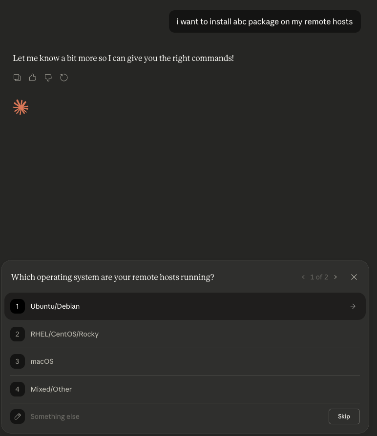
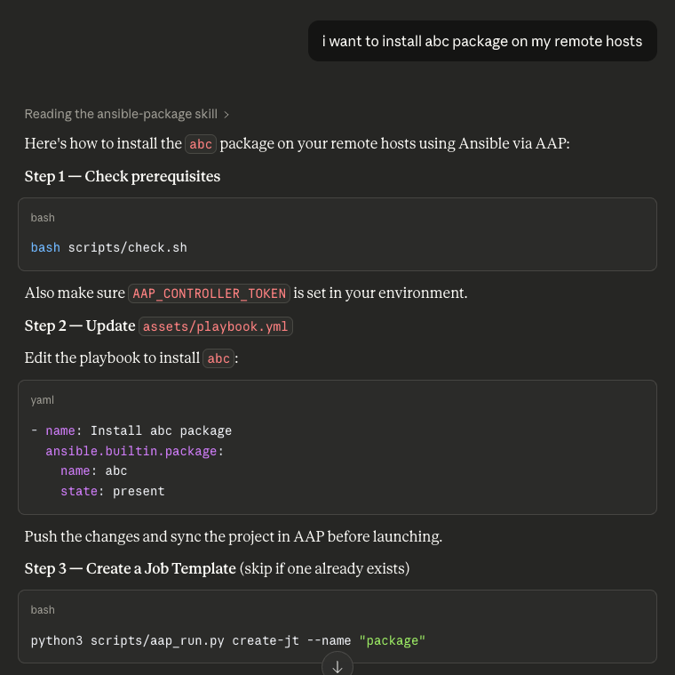

# AnsibleClaw User Guide

This guide covers everything you need to install, configure, and use AnsibleClaw -- both the command-line interface and the web dashboard -- including production execution through Ansible Automation Platform (AAP).

---

## Table of Contents

- [Installation](#installation)
- [Concepts](#concepts)
- [AI agents and Agent Skills (before vs after)](#ai-agents-and-agent-skills-before-vs-after)
- [CLI Reference](#cli-reference)
  - [ansibleclaw generate](#ansibleclaw-generate)
  - [ansibleclaw search](#ansibleclaw-search)
  - [ansibleclaw ui](#ansibleclaw-ui)
- [Web Dashboard](#web-dashboard)
  - [Explore: Modules](#explore-modules)
  - [Explore: Collections](#explore-collections)
  - [Build: Generate](#build-generate)
  - [Build: Compose](#build-compose)
  - [Skills](#skills)
  - [Deploy: Dev/Test](#deploy-devtest)
  - [Deploy: Production (AAP)](#deploy-production-aap)
  - [Agents: Gemini CLI](#agents-gemini-cli)
- [Built-In Skills](#built-in-skills)
- [Generated Skill Package](#generated-skill-package)
- [Inventory Setup](#inventory-setup)
- [End-to-End Workflows](#end-to-end-workflows)
  - [Visual user journey (AAP + skills factory)](#visual-user-journey-aap-skills-factory)
  - [CLI: Search, Generate, Use](#workflow-1-search-generate-use-cli)
  - [Web UI: Search, Generate, Install](#workflow-2-search-generate-install-web-ui)
  - [AI Agent Self-Expansion](#workflow-3-ai-agent-self-expansion)
  - [Batch Generate for a Team](#workflow-4-batch-generate-for-a-team)
  - [Collection-Wide Generation](#workflow-5-collection-wide-generation)
  - [AAP: Ad-Hoc Command via aap_run.py](#workflow-6-aap-ad-hoc-command)
  - [AAP: Job Template Launch via aap_run.py](#workflow-7-aap-job-template-launch)
  - [AAP: Deploy a Skill from the Web Dashboard](#workflow-8-aap-deploy-from-web-dashboard)
  - [AAP: Deploy a Collection from the Web Dashboard](#workflow-9-aap-deploy-collection-from-web-dashboard)
- [AAP Integration](#aap-integration)
  - [Setup](#aap-setup)
  - [Choosing CLI vs AAP](#choosing-cli-vs-aap)
  - [Using aap_run.py](#using-aap_runpy)
  - [Deploying Skills to AAP via the Web Dashboard](#deploying-skills-to-aap-via-the-web-dashboard)
  - [Direct API Calls](#direct-api-calls)
  - [Checking Prerequisites](#checking-prerequisites)
  - [AWX vs AAP Controller](#awx-vs-aap-controller)
- [Configuration](#configuration)
- [Troubleshooting](#troubleshooting)

---

## Installation

### Prerequisites

- Python 3.10 or later
- `uv` or `pip` package manager

### Install the core CLI

```bash
# From PyPI
pip install ansible-claw

# Or from source for development
pip install -e .
```

This installs `ansibleclaw` and its core dependencies: `ansible-core`, `jinja2`, and `pyyaml`.

### Install with the web dashboard

```bash
pip install "ansible-claw[ui]"

# Or from source
pip install -e ".[ui]"
```

This adds `fastapi`, `uvicorn`, `python-multipart`, and `websockets` for the web UI.

### Install with development tools

```bash
pip install -e ".[ui,dev]"
```

This adds `pytest` for running the test suite.

### Verify installation

```bash
ansibleclaw --version
```

---

## Concepts

AnsibleClaw has a clean two-phase model:

**Build-time** -- You (or an AI agent) run `ansibleclaw` to scrape Ansible module documentation and generate skill packages. This requires the `ansibleclaw` package.

**Runtime** -- The generated SKILL.md files teach AI agents to use standard `ansible` CLI commands or the AAP Controller API. The only runtime requirement is `ansible-core` (for CLI mode) or Python 3 stdlib (for AAP mode).

### What is a skill package?

A skill package is a directory containing a SKILL.md (with YAML frontmatter) plus supporting scripts that teach an AI agent how to use a specific Ansible module. Each package includes:

- **SKILL.md** -- Module description, parameters table, and dual-mode execution instructions (CLI + AAP)
- **scripts/run.sh** -- Local CLI wrapper with dry-run defaults
- **scripts/check.sh** -- Prerequisite validator for both CLI and AAP connectivity
- **scripts/publish_playbook.sh** -- Copies skill into AAP Project repo path and commits/pushes updates
- **scripts/aap_run.py** -- AAP Controller API helper (Python stdlib only, no pip install needed)
- **assets/playbook.yml** -- Ready-to-use Ansible playbook
- **assets/requirements.yml** -- Galaxy collection dependency (for non-builtin modules)

### Where do skills live?

By default, generated skills are written to the `skills/` directory inside the project. You can also install them directly into agent-specific directories:

| Platform | Path |
|----------|------|
| Project (default) | `skills/<skill_name>/` |
| Cursor | `~/.cursor/skills/<skill_name>/` |
| Claude Code | `~/.claude/skills/<skill_name>/` |
| Gemini CLI | `~/.gemini/skills/<skill_name>/` |
| Custom | Any path you specify with `--output` |

Skills are portable: copy the directory anywhere, download as a ZIP from the web dashboard, or upload to Claude.ai. They work wherever `ansible-core` is installed.

### Documentation resolution

When generating a skill, AnsibleClaw resolves module documentation through a fallback chain:

1. **Local** -- Runs `ansible-doc <module> --json` (ground truth, requires the collection to be installed)
2. **Auto-install** -- If `--auto-install` is passed, attempts `ansible-galaxy collection install` and retries local
3. **Galaxy API** -- Falls back to the Ansible Galaxy REST API to fetch documentation remotely

This means you can generate skills for collections you haven't installed locally -- the Galaxy fallback fetches the docs for you.

---

## AI agents and Agent Skills (before vs after)

AnsibleClaw exists so AI assistants do not have to **reinvent** Ansible workflows on every question. Host products (for example **Claude Desktop**, **Claude.ai** with uploaded skills, **Cursor**) expose [Agent Skills](https://agentskill.sh/readme) as files the model is instructed to read. Whether a skill is present changes what the user sees and what the agent can safely assume about your project.

### Example: installing a package on remote hosts

Suppose you ask: *"I want to install the `abc` package on my remote hosts."*

**Before any AnsibleClaw skill is installed**, a typical assistant has only general training data. It often responds with a **guided questionnaire**: short prose ("Tell me more…") plus UI steps such as picking an OS family (Ubuntu/Debian, RHEL, macOS, mixed) before it suggests commands. The advice is **not anchored** to your repo: you still map answers to inventory, playbooks, and execution style (CLI vs Ansible Automation Platform) yourself.



**After you add a generated module skill** (for example the skill produced from `ansible.builtin.package`) and the agent loads it, behavior shifts:

- The UI may show that the model is **reading a named skill** (for example "Reading the ansible-package skill").
- The reply is **structured and local**: run `bash scripts/check.sh`, edit `assets/playbook.yml` with an `ansible.builtin.package` task, set `AAP_CONTROLLER_TOKEN` when using AAP, run `python3 scripts/aap_run.py create-jt …` when creating job templates, and so on.
- Instructions stay **consistent** with the dual-mode layout every generated package uses (`SKILL.md`, `scripts/`, `assets/`).



### Summary comparison

| Dimension | Before Skills | After Skills (AnsibleClaw packages) |
|-----------|----------------|-------------------------------------|
| **Grounding** | Generic best practices | Module docs + your skill's file layout |
| **First turn** | Clarifying questions / wizards | Often direct steps from `SKILL.md` |
| **Paths** | Invented or placeholder | `scripts/check.sh`, `scripts/publish_playbook.sh`, `assets/playbook.yml`, `scripts/aap_run.py` |
| **AAP** | Optional, easy to skip | Documented in skill; helper script included |
| **Team reuse** | Everyone re-prompts | Install or ZIP the same skill directory |

Built-in skills shipped with `ansible-claw` (`ansible_search`, `ansible_manager`, `ansible_skills_factory`, `ansible_aap_guide`) extend this idea: they teach the agent how to **discover modules**, **run ad-hoc Ansible**, **generate new skills**, and **choose AAP vs CLI** without you writing those instructions from scratch.

---

## CLI Reference

AnsibleClaw provides four subcommands: `generate`, `search`, `uninstall`, and `ui`.

### ansibleclaw generate

Generate a full skill package for any Ansible module, or batch-generate for an entire collection.

```
ansibleclaw generate <module> [options]
ansibleclaw generate --collection <FQCN> [options]
```

**Arguments:**

| Argument | Description |
|----------|-------------|
| `module` | Fully-qualified module name (e.g., `ansible.builtin.apt`) |
| `--install PLATFORM` | Install directly to an agent platform (`cursor`, `claude`, or `gemini`) |
| `--output DIR` | Write to a custom directory instead of the project `skills/` |
| `--zip` | Also create a `.zip` archive for distribution |
| `--auto-install` | Auto-install the collection via `ansible-galaxy` if not present locally |
| `--collection-version VER` | Pin the collection version for Galaxy fallback docs |
| `--collection FQCN` | Generate skills for all modules in a collection |
| `--modules LIST` | Comma-separated module short names to include (used with `--collection`) |

**Examples:**

```bash
# Generate into the project's skills/ directory
ansibleclaw generate "ansible.builtin.apt"
# Output: skills/ansible_apt/

# Generate and create a distributable ZIP
ansibleclaw generate "ansible.builtin.apt" --zip

# Install directly into Cursor
ansibleclaw generate "community.general.redis" --install cursor
# Output: ~/.cursor/skills/ansible_redis/

# Install directly into Claude Code
ansibleclaw generate "community.docker.docker_container" --install claude
# Output: ~/.claude/skills/ansible_docker_docker_container/

# Install into Gemini CLI
ansibleclaw generate "ansible.builtin.apt" --install gemini
# Output: ~/.gemini/skills/ansible_apt/

# Custom path
ansibleclaw generate "ansible.builtin.user" --output /tmp/my-skills/

# Auto-install the collection if missing, pin version
ansibleclaw generate "community.docker.docker_container" --auto-install --collection-version 3.8.0

# Generate skills for every module in a collection
ansibleclaw generate --collection ansible.posix

# Generate skills for specific modules in a collection
ansibleclaw generate --collection ansible.posix --modules "firewalld,sysctl"
```

**What happens under the hood:**

1. Resolves documentation via the fallback chain (local `ansible-doc` -> auto-install -> Galaxy API)
2. Extracts parameters, examples, and description
3. Renders the Jinja2 templates with the extracted data
4. Writes the full skill package (SKILL.md, scripts/, assets/) to the target directory
5. Prints the output path so you (or an AI agent) can immediately read the result

### ansibleclaw search

Search for Ansible modules by keyword.

```
ansibleclaw search [keyword] [--namespace NS] [--detail MODULE]
```

**Arguments:**

| Argument | Description |
|----------|-------------|
| `keyword` | Search term to match against module names and descriptions |
| `--namespace`, `-n` | Filter results to a specific namespace (e.g., `community.docker`) |
| `--detail MODULE` | Show full JSON documentation for a specific module |

**Examples:**

```bash
# Search for modules related to "redis"
ansibleclaw search "redis"
#   community.general.redis            Various redis commands, replica and flush
#   community.general.redis_data       Set key value pairs in Redis
#   community.general.redis_info       Gather Redis server information
#   3 module(s) found.

# Search within a specific namespace
ansibleclaw search "container" --namespace community.docker

# Browse all modules in a namespace (no keyword)
ansibleclaw search --namespace ansible.builtin

# Get full JSON docs for a module
ansibleclaw search --detail "community.general.redis"
```

**Tip:** Ansible has 3000+ modules. Always use `--namespace` to narrow results when you know the domain (e.g., `community.docker` for Docker, `amazon.aws` for AWS).

### ansibleclaw uninstall

Remove a skill directory from an **agent platform** install path. This does **not** delete skills from the project `skills/` directory (use the web UI **Delete** action for that).

```
ansibleclaw uninstall <skill_dir_name> --platform {cursor|claude|gemini}
```

| Argument | Description |
|----------|-------------|
| `skill_dir_name` | Directory name (e.g. `ansible_package`, `ansible_apt`) |
| `--platform` | Required: `cursor`, `claude`, or `gemini` |

If the path is already missing, the command exits successfully (idempotent).

```bash
ansibleclaw uninstall ansible_apt --platform gemini
```

### ansibleclaw ui

Launch the web management dashboard.

```
ansibleclaw ui [--port PORT]
```

| Argument | Description |
|----------|-------------|
| `--port PORT` | Port to listen on (default: `8600`) |

```bash
ansibleclaw ui
# Starting AnsibleClaw UI at http://localhost:8600

ansibleclaw ui --port 9000
```

Requires `pip install "ansible-claw[ui]"`. If FastAPI is not available, you'll see a helpful error message.

---

## Web Dashboard

The web dashboard provides a graphical interface for all AnsibleClaw operations. Start it with `ansibleclaw ui` and open `http://localhost:8600` in your browser.

The dashboard features a collapsible left sidebar (styled with PatternFly v6) organized into five sections: **Explore**, **Build**, **Skills**, **Deploy**, and **Agents**. Dark and light themes are available via the toggle in the top masthead.

### Explore: Modules

**URL:** `/search` | **Sidebar:** Explore > Modules

Search for Ansible modules interactively:

1. Enter a **keyword** (e.g., "redis", "docker", "firewall")
2. Optionally enter a **namespace** to filter results (e.g., `community.general`)
3. Click **Search**

Results appear in a table without a page reload (powered by HTMX). For each module you can:

- Click **Details** to expand the module's parameters and examples inline
- Click **Generate Skill** to jump to the generator page pre-filled with that module name

### Explore: Collections

**URL:** `/collections` | **Sidebar:** Explore > Collections

Manage your installed Ansible collections:

- View all installed collections with version numbers and module counts
- Click a collection name to see all its modules, with links to generate skills or view details
- **Install** a new collection by name (and optional version) directly from Galaxy
- **Uninstall** collections you no longer need
- **Generate Skills** -- batch-generate skill packages for selected modules in a collection
- **Generate Collection Overview** -- create a single overview skill that summarizes all modules in a collection

From a collection's detail page, you can also **Deploy to AAP** to create Job Templates for every generated module skill in the collection.

### Build: Generate

**URL:** `/generate` | **Sidebar:** Build > Generate

Generate new single-module skills through the browser:

1. Enter the **module name** (e.g., `community.general.redis`)
2. Select a **target**:
   - **Project (skills/)** -- write to the project's skills directory
   - **Cursor** -- install directly to `~/.cursor/skills/`
   - **Claude** -- install directly to `~/.claude/skills/`
   - **Gemini** -- install directly to `~/.gemini/skills/`
   - **Custom path** -- specify any directory
3. Click **Preview** to see what the SKILL.md will look like before generating
4. Click **Generate** to create the full skill package

The preview pane shows the rendered SKILL.md in real time without writing any files. If the collection is not installed locally, the preview will note that docs were sourced from Galaxy.

After generation, a **Download ZIP** link appears for project-target skills.

### Build: Compose

**URL:** `/compose` | **Sidebar:** Build > Compose

Compose multi-module composite skill packages that combine several Ansible modules into a single use-case-driven skill:

1. Enter a **Skill Name** and optional **Description**
2. Add modules using the autocomplete picker (search or type a FQCN)
3. Select a **target** (Project, Cursor, Claude, Gemini, or custom path)
4. Click **Preview** to inspect the composite SKILL.md before writing
5. Click **Compose** to generate the full composite skill package

Composite skills are ideal for multi-step workflows (e.g., "deploy and configure a web server" combining `ansible.builtin.package`, `ansible.builtin.template`, `ansible.builtin.service`, and `ansible.builtin.firewalld`).

### Skills

**URL:** `/skills` | **Sidebar:** Skills > Skills

This is the home page. It shows all skills (built-in + generated) in a table with:

- **Name** -- Click to view the full SKILL.md content
- **Description** -- Short summary from the YAML frontmatter
- **Type** -- `built-in` (ships with AnsibleClaw) or `generated` (created by the factory)
- **Actions:**
  - **Download** -- Download the skill as a ZIP archive
  - **Install** -- Copy a skill to Cursor, Claude Code, or Gemini CLI’s skill directory with one click
  - **Uninstall** -- Remove the skill copy from Cursor, Claude, or Gemini CLI (project `skills/` unchanged)
  - **Delete** -- Remove a generated skill (built-in skills cannot be deleted)

Clicking a skill name opens the detail view showing the SKILL.md content. From the detail page, you can also **Deploy to AAP** (see [AAP Integration](#deploying-skills-to-aap-via-the-web-dashboard)).

### Deploy: Dev/Test

**URL:** `/inventory` | **Sidebar:** Deploy > Dev/Test

Manage your local Ansible inventory for development and testing. View and edit host groups, set connection variables, and verify inventory structure before deploying to production.

### Deploy: Production (AAP)

**URL:** `/aap` | **Sidebar:** Deploy > Production

Interactive AAP Controller dashboard:

- **Connection status** -- shows connected, configured (but untested), or not configured
- **Resource summary** -- cards showing counts of projects, job templates, inventories, execution environments, and credentials
- **Projects table** -- lists AAP projects with deep links to the AAP Controller UI
- **Job Templates table** -- lists templates with deep links to launch or view in AAP
- **Sync button** -- manually refresh dashboard data from the AAP Controller
- **Test Connectivity** -- pings the controller's `/api/v2/ping/` endpoint with streaming results
- **Setup instructions** -- if not configured, shows the required environment variables

### Agents: Gemini CLI

**URL:** `/agents/gemini` | **Sidebar:** Agents > Gemini CLI

Launch an interactive browser-based terminal running Google's Gemini CLI agent:

- **Prerequisites check** -- automatically detects if `ttyd` and `gemini` are installed, with install instructions if missing
- **Working directory** -- specify the directory where the Gemini agent operates
- **Session management** -- Launch, Stop, and Clear buttons for controlling the terminal session
- **Persistent sessions** -- navigating away and returning reconnects to the running Gemini session (output history is not preserved, but the process stays alive)

Requires `ttyd` (`brew install ttyd`) and the [Gemini CLI](https://github.com/google-gemini/gemini-cli) to be installed on the host.

---

## Built-In Skills

AnsibleClaw ships with four built-in skills inside the package (at `src/ansibleclaw/builtins/`). These are always available in the web dashboard and can be installed to any agent platform.

### ansible_manager -- The Executor

Teaches an AI agent to run any Ansible module using the `ansible` CLI or AAP. Covers:

- Ad-hoc command syntax: `ansible <hosts> -m <module> -a "<args>" -b`
- Essential flags (`-b`, `--check`, `--diff`, `-i`, `-l`)
- Common patterns (packages, services, users, files, shell commands)
- Safety protocol (always dry-run first)
- JSON output for programmatic parsing
- Inventory portability (inside vs. outside the project)

**Runtime dependency:** `ansible-core` only

### ansible_search -- The Scout

Teaches an AI agent to discover Ansible modules using `ansible-doc`. Covers:

- Namespace-first search strategy (avoid 3000+ module dumps)
- Common namespace reference table (builtin, posix, docker, aws, etc.)
- Step-by-step workflow: list -> inspect -> get JSON
- How to translate playbook YAML examples to CLI ad-hoc commands
- When to escalate to the factory for complex modules

**Runtime dependency:** `ansible-core` only

### ansible_skills_factory -- The Architect

Teaches an AI agent to generate new skills on-demand using `ansibleclaw generate`. Covers:

- When to generate vs. using the manager skill directly
- All output targets (project, Cursor, Claude, custom)
- The self-expansion workflow: search -> generate -> read -> use
- What each generated skill package contains (dual-mode SKILL.md + scripts + assets)

**Runtime dependency:** `ansibleclaw` (this is the only skill that requires the build tool)

### ansible_aap_guide -- The Production Guide

Teaches an AI agent how to use Ansible Automation Platform as the production execution backend. Covers:

- When to use AAP mode vs. direct CLI
- Environment variable setup (`AAP_CONTROLLER_URL`, `AAP_CONTROLLER_TOKEN`)
- Key AAP concepts: inventories, credentials, job templates, organizations
- How to discover available resources via the AAP API
- Decision tree for choosing CLI vs. AAP execution
- Common troubleshooting (SSL errors, auth failures)

**Runtime dependency:** Python 3 (stdlib only)

---

## Generated Skill Package

Each generated skill is a complete [Agent Skills](https://agentskill.sh/readme) package:

```
ansible_apt/
├── SKILL.md              # Dual-mode instructions (CLI + AAP)
├── scripts/
│   ├── run.sh            # CLI wrapper (dry-run by default, --apply to execute)
│   ├── check.sh          # Prerequisite validator (CLI + AAP connectivity)
│   └── aap_run.py        # AAP Controller API helper (Python stdlib only)
└── assets/
    ├── playbook.yml      # Ready-to-use Ansible playbook
    └── requirements.yml  # Galaxy collection dependency (non-builtin modules only)
```

| File | Purpose | Runtime Dependency |
|------|---------|-------------------|
| `SKILL.md` | Agent reads this for parameters, CLI usage, and AAP API usage | None |
| `scripts/run.sh` | Wraps `ansible` CLI with safe dry-run defaults | `ansible-core` |
| `scripts/check.sh` | Validates CLI tools and AAP connectivity | `ansible-core`, `curl` |
| `scripts/publish_playbook.sh` | Syncs skill files into AAP Project SCM checkout and pushes | `git` |
| `scripts/aap_run.py` | Launches ad-hoc commands and job templates via AAP REST API | Python 3 (stdlib) |
| `assets/playbook.yml` | Ansible playbook with example tasks | `ansible-core` |
| `assets/requirements.yml` | Galaxy dependency for the collection | `ansible-galaxy` |

The SKILL.md is structured with an **Execution Mode** routing block at the top that directs agents to the correct path:

- **AAP mode** (when AAP is configured): imperative instructions using `scripts/aap_run.py` with pre-filled AAP settings (URL, inventory, credential, project) baked in at generation time
- **CLI mode** (default): direct `ansible` commands for development and testing

When AAP is configured in AnsibleClaw, generated skills embed the resolved AAP settings directly into the documentation and helper scripts, so agents can execute without additional configuration.

---

## Inventory Setup

When using CLI mode, create an inventory file. Here is an example `inventory/hosts.yml`:

```yaml
all:
  hosts:
    localhost:
      ansible_connection: local
  children:
    webservers:
      hosts:
        web1.example.com:
        web2.example.com:
    dbservers:
      hosts:
        db1.example.com:
```

### How ansible.cfg helps

The project's `ansible.cfg` sets two defaults:

```ini
[defaults]
inventory = inventory/hosts.yml
stdout_callback = json
```

Any `ansible` command run from the project directory automatically uses the local inventory and returns JSON output. No `-i` flag or environment variables needed.

### Using skills outside the project

When a generated SKILL.md is used outside the AnsibleClaw project directory, the inventory section in each skill explains how to specify inventory:

```bash
# Explicit flag
ansible -i /path/to/inventory.yml webservers -m ansible.builtin.package -a "name=nginx state=present" -b

# Environment variable
export ANSIBLE_INVENTORY=/path/to/inventory.yml

# Single host shortcut (note the trailing comma)
ansible myhost.example.com, -m ansible.builtin.package -a "name=nginx state=present" -b
```

---

## End-to-End Workflows

### Visual user journey (AAP + skills factory)

For a **single picture** of how configuration, generation, **Deploy to AAP**, and **agentic** distribution fit together, see the Mermaid diagram in **[workflow.md](workflow.md#user-workflow-production-execution-and-two-delivery-routes)** (*User workflow: production execution and two delivery routes*).

**Summary of that journey:**

1. **Configure AAP as production runtime** -- Set `AAP_CONTROLLER_URL`, `AAP_CONTROLLER_TOKEN`, and optional defaults (environment variables, `.ansibleclaw.yml`, and test from the dashboard's **Deploy > Production** page). Skill generation can embed Controller defaults; tokens are never written into packages.
2. **Select a module or collection** -- Use **Explore > Modules**, **Explore > Collections**, or the CLI. **Install the collection** if it is missing (Collections page, `ansible-galaxy`, or `ansibleclaw generate --auto-install`).
3. **Generate skills** -- Web **Generate**, `ansibleclaw generate` (including `--collection`), or an AI using the **`ansible_skills_factory`** built-in skill.
4. **Choose how production work is triggered:**
   - **Human admin** -- Use **Deploy to AAP** on a skill or collection detail page: push to the Project’s Git SCM, sync, and create a **Job Template**. AnsibleClaw does **not** launch jobs; the playbook path is project-relative and is **not** re-checked against the Controller after sync.
   - **Agentic tools** -- **Download ZIP** or **Install** to Cursor / Claude / **Gemini CLI** (CLI `--install`, or dashboard). End users **prompt** the assistant; the agent **refines** `assets/playbook.yml` and should **git push** changes to the **same remote** as the AAP Project. **Job Template creation** is the usual handoff; **AAP administrators** run jobs from the Controller unless policy allows `aap_run.py launch` ([Workflow 3](#workflow-3-ai-agent-self-expansion), [Workflow 6](#workflow-6-aap-ad-hoc-command), [Workflow 7](#workflow-7-aap-job-template-launch)).

The sections below walk through each pattern in more detail.

### Workflow 1: Search, Generate, Use (CLI)

```bash
# 1. Search for the module you need
ansibleclaw search "docker" --namespace community.docker

# 2. Generate a skill for it
ansibleclaw generate "community.docker.docker_container"
# Skill generated: skills/ansible_docker_docker_container/
#   SKILL.md, scripts/run.sh, scripts/check.sh, scripts/publish_playbook.sh, scripts/aap_run.py, assets/playbook.yml

# 3. Read the generated skill
cat skills/ansible_docker_docker_container/SKILL.md

# 4. Use it (or let your AI agent use it)
ansible webservers -m community.docker.docker_container \
  -a "name=myapp image=nginx state=started" -b --check --diff
```

### Workflow 2: Search, Generate, Install (Web UI)

1. Run `ansibleclaw ui`
2. Go to **Explore > Modules** -- search for "docker container"
3. Click **Details** on `community.docker.docker_container` to see parameters inline
4. Click **Generate Skill** -- jumps to the Generator with the module name pre-filled
5. Click **Preview** to inspect the SKILL.md before writing any files
6. Select **Cursor** as the target and click **Generate**
7. The skill is now at `~/.cursor/skills/ansible_docker_docker_container/`

### Workflow 3: AI Agent Self-Expansion

When an AI agent encounters a task requiring an unfamiliar Ansible module:

1. Agent reads the `ansible_search` skill and runs `ansible-doc --list community.general | grep redis`
2. Agent reads the `ansible_skills_factory` skill and runs `ansibleclaw generate "community.general.redis"`
3. CLI prints: `Skill generated: skills/ansible_general_redis/`
4. Agent reads the new `skills/ansible_general_redis/SKILL.md` for parameter guidance
5. Agent checks for `AAP_CONTROLLER_URL`:
   - **Not set** -- runs: `ansible redis_cluster -m community.general.redis -a "..." -b --check --diff`
   - **Set** -- runs: `python3 scripts/aap_run.py adhoc "..." --inventory Production --credential "SSH Key"`
6. Agent reports results to the user

### Workflow 4: Batch Generate for a Team

```bash
for module in \
    ansible.builtin.apt \
    ansible.builtin.systemd \
    ansible.builtin.user \
    ansible.builtin.copy \
    ansible.builtin.template \
    community.docker.docker_container \
    community.general.ufw \
    community.mysql.mysql_db; do
    ansibleclaw generate "$module" --install cursor
done
```

Every developer on the team now has these skills available in Cursor.

### Workflow 5: Collection-Wide Generation

Generate skills for every module in a collection at once:

```bash
# All modules in ansible.posix
ansibleclaw generate --collection ansible.posix

# Only specific modules
ansibleclaw generate --collection community.docker --modules "docker_container,docker_image,docker_network"
```

Or from the web dashboard:

1. Go to **Explore > Collections** (`/collections`)
2. Click a collection name to see its modules
3. Select the modules you want and click **Generate Skills**
4. Optionally click **Generate Collection Overview** for a summary skill

### Workflow 6: AAP Ad-Hoc Command

Run a module through AAP instead of direct SSH:

```bash
# Set up AAP credentials
export AAP_CONTROLLER_URL="https://aap.example.com"
export AAP_CONTROLLER_TOKEN="your-oauth2-token"

# Generate the skill (if not already done)
ansibleclaw generate "ansible.builtin.package"

# Run via AAP
cd skills/ansible_package/
python3 scripts/aap_run.py adhoc "name=nginx state=present" \
  --inventory "Production" --credential "Machine SSH Key"

# Dry-run via AAP
python3 scripts/aap_run.py adhoc "name=nginx state=present" \
  --inventory "Production" --credential "Machine SSH Key" --check
```

The helper script resolves resource names to IDs, launches the ad-hoc command, polls until completion, and prints structured JSON output.

### Workflow 7: AAP Job Template Launch

Launch a pre-configured Job Template:

```bash
# Launch with extra variables
python3 scripts/aap_run.py launch "deploy-webservers" \
  --extra-vars '{"version": "2.0"}'

# Launch with host limiting
python3 scripts/aap_run.py launch "deploy-webservers" \
  --limit "web1.example.com"

# Check status of a running job
python3 scripts/aap_run.py status 42
```

### Workflow 8: AAP Deploy from Web Dashboard

Create a Job Template in AAP directly from the web dashboard:

1. Run `ansibleclaw ui` (with `AAP_CONTROLLER_URL` and `AAP_CONTROLLER_TOKEN` set)
2. Go to **Skills** and click a skill name
3. Scroll to the **Deploy to AAP** card
4. The form auto-populates dropdowns from your AAP Controller:
   - **Project** -- select an existing SCM Project, or create a new one by providing a Git repo URL
   - **Execution Environment** -- select an EE (ensure it includes the required collection)
   - **Inventory** -- select the target inventory
   - **Credential** -- select a Machine credential for SSH access
5. Click **Deploy to AAP**
6. AnsibleClaw creates the Job Template via `POST /api/v2/job_templates/`, attaches the credential, and returns a link to view it in your AAP Controller

### Workflow 9: AAP Deploy Collection from Web Dashboard

Deploy Job Templates for every generated module in a collection:

1. Go to **Explore > Collections** and click a collection name
2. Scroll to the **Deploy to AAP** card
3. Select Project, EE, Inventory, and Credential
4. Click **Deploy Collection to AAP**
5. AnsibleClaw creates one Job Template per module skill, linking each to the corresponding `assets/playbook.yml`

---

## AAP Integration

Generated skills include **dual-mode execution**: local CLI for development/testing, and AAP Controller API for governed production runs.

### AAP Setup

Set these environment variables to enable AAP mode:

```bash
export AAP_CONTROLLER_URL="https://aap.example.com"
export AAP_CONTROLLER_TOKEN="your-oauth2-token"
export AAP_VERIFY_SSL="true"                    # set to "false" for self-signed certs
export AAP_DEFAULT_INVENTORY="Production"       # optional: default inventory name or ID
export AAP_DEFAULT_CREDENTIAL="Machine SSH Key" # optional: default credential name or ID
export AAP_DEFAULT_ORGANIZATION="Default"       # optional: organization name
```

**Getting a token:** Generate a personal access token in the AAP/AWX web UI under **Users** > your user > **Tokens**. Or via the API:

```bash
curl -s -X POST "https://aap.example.com/api/v2/tokens/" \
  -u "admin:password" \
  -H "Content-Type: application/json" \
  -d '{"scope": "write"}'
```

### Choosing CLI vs AAP

| Scenario | Use |
|----------|-----|
| Development and testing | CLI (`ansible` commands) |
| Production with RBAC, audit logging | AAP (`aap_run.py` or API) |
| Centralized credentials (SSH keys in AAP) | AAP |
| Local-only tasks (targeting localhost) | CLI |
| AAP not available | CLI |
| Approval workflows required | AAP |

The `ansible_aap_guide` built-in skill teaches AI agents this decision tree automatically.

### Using aap_run.py

Every generated skill includes `scripts/aap_run.py` -- a Python 3 stdlib-only helper that wraps the AAP Controller REST API. When AAP is configured, the script ships with baked defaults (URL, inventory, credential, project) so agents need only the `AAP_CONTROLLER_TOKEN` environment variable. It has four subcommands:

**Ad-hoc command** (equivalent to `ansible <hosts> -m <module> -a "<args>"`):

```bash
python3 scripts/aap_run.py adhoc "name=nginx state=present" \
  --inventory "Production" --credential "Machine SSH Key"
```

**Launch a Job Template** (equivalent to `ansible-playbook`):

```bash
python3 scripts/aap_run.py launch "deploy-webservers" \
  --extra-vars '{"version": "2.0"}' --limit "web1.example.com"
```

**Create a Job Template** (so agents can autonomously set up AAP resources):

```bash
python3 scripts/aap_run.py create-jt --name "package-deploy" \
  --project "AnsibleClaw" --inventory "Production" --credential "Machine SSH Key"
```

**Check job status:**

```bash
python3 scripts/aap_run.py status 42
```

All commands output structured JSON. The helper resolves resource names to numeric IDs, launches the operation, polls until a terminal state (successful, failed, error, canceled), retrieves stdout, and exits with an appropriate code.

### Deploying Skills to AAP via the Web Dashboard

When the web dashboard detects that `AAP_CONTROLLER_URL` and `AAP_CONTROLLER_TOKEN` are set, it enables AAP deployment forms on skill detail pages and collection detail pages. These forms:

1. Fetch available Projects, Execution Environments, Inventories, and Credentials from your AAP Controller via its REST API
2. Let you select (or create) a Project pointing to a Git repo containing the generated playbooks
3. Create a Job Template via `POST /api/v2/job_templates/` linking the skill's playbook, your chosen inventory, and EE
4. Attach the selected Machine credential to the template
5. Return a direct link to the Job Template in your AAP Controller UI

For collections, a single deployment creates one Job Template per module skill.

### Direct API Calls

Each generated SKILL.md also includes raw `curl` examples:

```bash
# Ad-hoc command
curl -s -X POST "${AAP_CONTROLLER_URL}/api/v2/ad_hoc_commands/" \
  -H "Authorization: Bearer ${AAP_CONTROLLER_TOKEN}" \
  -H "Content-Type: application/json" \
  -d '{
    "inventory": 1,
    "credential": 1,
    "module_name": "ansible.builtin.package",
    "module_args": "name=nginx state=present",
    "become_enabled": true
  }'

# Launch a job template
curl -s -X POST "${AAP_CONTROLLER_URL}/api/v2/job_templates/42/launch/" \
  -H "Authorization: Bearer ${AAP_CONTROLLER_TOKEN}" \
  -H "Content-Type: application/json" \
  -d '{"extra_vars": {"target_hosts": "webservers"}}'
```

### Checking Prerequisites

Run the generated `scripts/check.sh` to verify both CLI and AAP prerequisites:

```bash
bash scripts/check.sh
```

This checks for `ansible` CLI tools, and if `AAP_CONTROLLER_URL` is set, also tests connectivity to the AAP Controller via `/api/v2/ping/`.

### AWX vs AAP Controller

Both AWX (free upstream) and Red Hat AAP Controller (commercial) share the same REST API (`/api/v2/`). AnsibleClaw supports both interchangeably -- develop against AWX for free, deploy through AAP Controller for enterprise governance.

---

## Configuration

AnsibleClaw reads configuration from environment variables with sensible defaults.

### General

| Variable | Default | Description |
|----------|---------|-------------|
| `ANSIBLECLAW_SKILLS_DIR` | `./skills/` (CWD) | Where generated skills are written |
| `ANSIBLECLAW_COLLECTIONS_PATH` | *(empty)* | Custom path for Ansible collections (sets `ANSIBLE_COLLECTIONS_PATH`) |
| `ANSIBLECLAW_GALAXY_URL` | `https://galaxy.ansible.com` | Galaxy server URL for fallback doc resolution |

### AAP Controller

| Variable | Default | Description |
|----------|---------|-------------|
| `AAP_CONTROLLER_URL` | *(empty)* | Base URL of AAP/AWX controller |
| `AAP_CONTROLLER_TOKEN` | *(empty)* | OAuth2 bearer token for AAP |
| `AAP_VERIFY_SSL` | `true` | Set to `false` for self-signed certs |
| `AAP_DEFAULT_INVENTORY` | *(empty)* | Default inventory name or ID for ad-hoc commands |
| `AAP_DEFAULT_CREDENTIAL` | *(empty)* | Default credential name or ID |
| `AAP_DEFAULT_ORGANIZATION` | `Default` | Organization name in AAP |
| `AAP_DEFAULT_PROJECT` | *(empty)* | Default project name or ID (used by web dashboard) |
| `AAP_DEFAULT_EE` | *(empty)* | Default Execution Environment name or ID (used by web dashboard) |

**Example:**

```bash
export ANSIBLECLAW_SKILLS_DIR=/opt/shared-skills/
ansibleclaw generate "ansible.builtin.apt"
# Writes to /opt/shared-skills/ansible_apt/
```

### Install paths

Skills can be installed directly to agent platforms:

| Platform | Install Path |
|----------|-------------|
| `cursor` | `~/.cursor/skills/` |
| `claude` | `~/.claude/skills/` |
| `gemini` | `~/.gemini/skills/` |

Use `ansibleclaw uninstall <name> --platform <platform>` to remove a copy from one of these directories.

---

## Troubleshooting

### "ansible-doc not found"

AnsibleClaw needs `ansible-core` installed in the same Python environment. Verify:

```bash
which ansible-doc
ansible-doc --version
```

If using a virtual environment, make sure `ansible-core` is installed there:

```bash
pip install ansible-core
```

### "Web UI dependencies not installed"

The web dashboard requires extra packages:

```bash
pip install "ansible-claw[ui]"
```

### "No modules found" when searching

Ansible collections need to be installed for their modules to appear in `ansible-doc`. The built-in modules (`ansible.builtin.*`) are always available with `ansible-core`. For community modules:

```bash
ansible-galaxy collection install community.general
ansible-galaxy collection install community.docker
```

Alternatively, use `--auto-install` when generating to install the collection automatically:

```bash
ansibleclaw generate "community.docker.docker_container" --auto-install
```

### Module not found during generation

If the collection isn't installed locally, AnsibleClaw falls back to the Galaxy API automatically. To force local resolution, install the collection first:

```bash
ansible-galaxy collection install <namespace.collection>
ansibleclaw generate "<namespace.collection.module>"
```

### Galaxy fallback shows a warning

When documentation is sourced from Galaxy instead of local `ansible-doc`, the generated skill includes a note:

> Documentation sourced from Galaxy (namespace.collection vX.Y.Z). Your installed version may differ.

To use exact local docs, install the collection and regenerate:

```bash
ansible-galaxy collection install <namespace.collection>
ansibleclaw generate "<namespace.collection.module>"
```

### AAP connection failures

| Problem | Solution |
|---------|----------|
| `SSL: CERTIFICATE_VERIFY_FAILED` | Set `AAP_VERIFY_SSL=false` for self-signed certs |
| `HTTP 401` | Token is invalid or expired -- regenerate in AAP UI |
| `HTTP 403` | Token lacks permissions -- check RBAC roles in AAP |
| Inventory not found | List inventories to find the correct name/ID |
| Job stays in `pending` | AAP may lack capacity -- check instance groups |

Test connectivity from the web dashboard at **Deploy > Production** (`/aap`) or from the command line:

```bash
curl -s -H "Authorization: Bearer ${AAP_CONTROLLER_TOKEN}" \
  "${AAP_CONTROLLER_URL}/api/v2/ping/"
```

### Inventory not found when running ansible commands

If you're running `ansible` commands outside the AnsibleClaw project directory, `ansible.cfg` won't be picked up. Use `-i` to specify the inventory path explicitly:

```bash
ansible -i /path/to/AnsibleClaw/inventory/hosts.yml webservers -m ping
```

### Running tests

```bash
pip install -e ".[dev]"
python -m pytest tests/ -v
```
