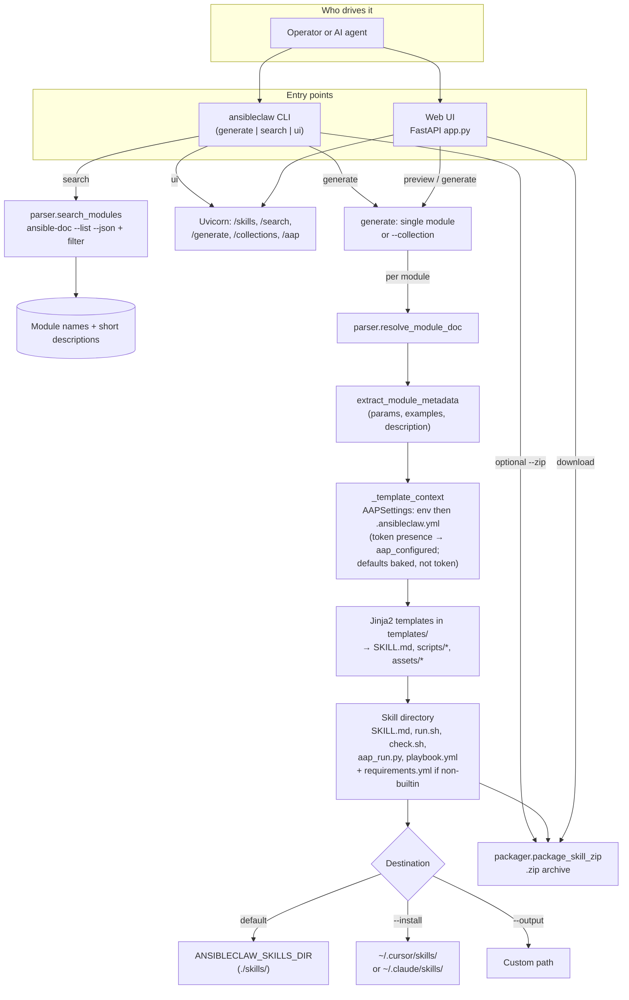
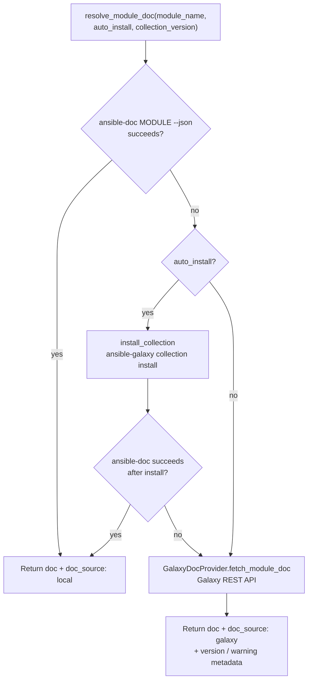
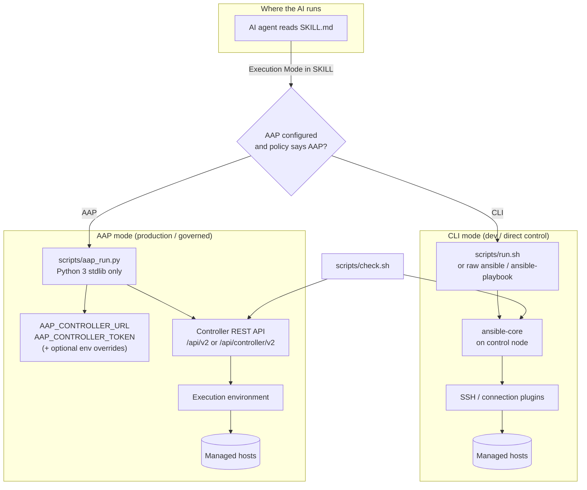
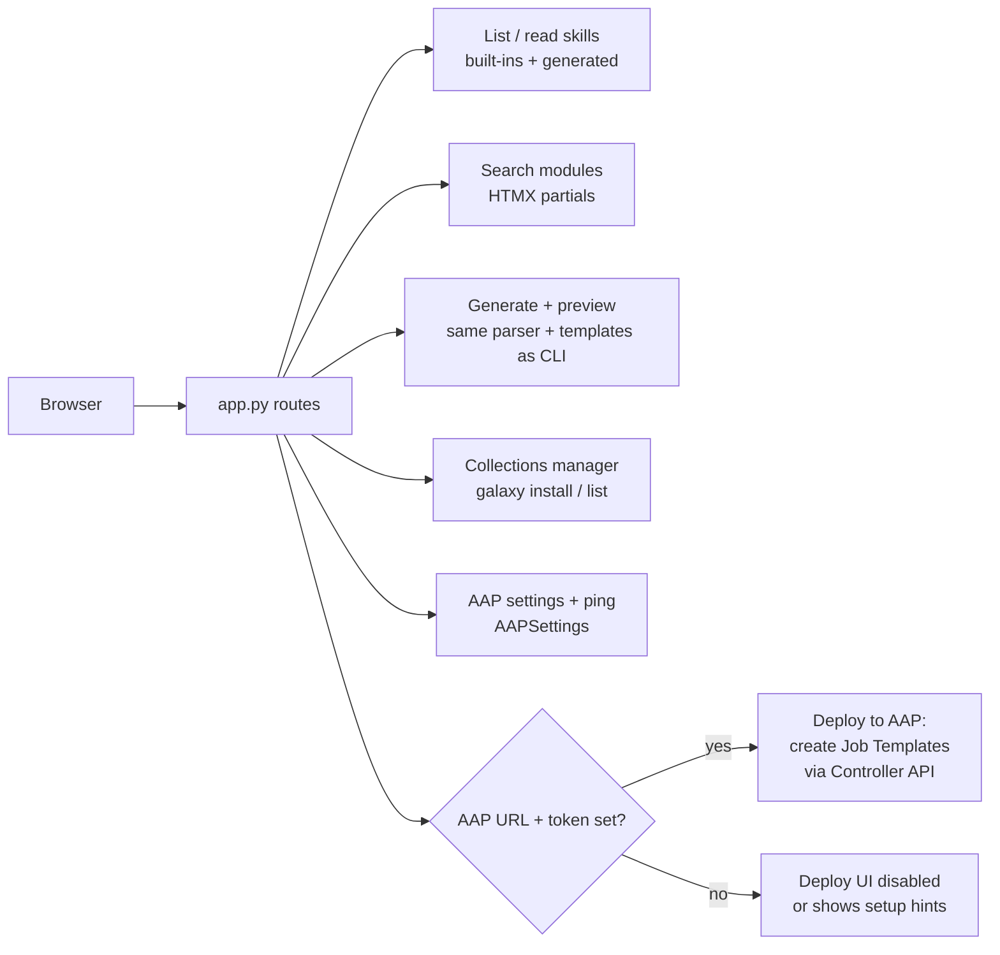

# AnsibleClaw workflow diagrams

These diagrams reflect the current implementation under `src/ansibleclaw/` (CLI, `core/parser.py`, `core/galaxy.py`, `core/packager.py`, `config.AAPSettings`, and `web/app.py`).

## End-to-end: entry points to skill package

## Module documentation resolution

Collection-wide generation (`ansibleclaw generate --collection`) first calls `list_modules(namespace)`, then runs the same `resolve_module_doc` → `_write_skill_package` path for each selected module. A separate path builds a **collection overview** skill via `collection_skill_template.md` plus `requirements.yml` only (no per-module scripts).

## Runtime: how an agent uses a generated skill

`check.sh` validates `ansible` / inventory assumptions when present and, if `AAP_CONTROLLER_URL` is set, pings the Controller (using `AAP_CONTROLLER_TOKEN` for auth).

## Web dashboard and AAP deploy (optional)

For a concise historical variant of the build vs runtime split, see also [design.md](../design.md) in the repository root.
