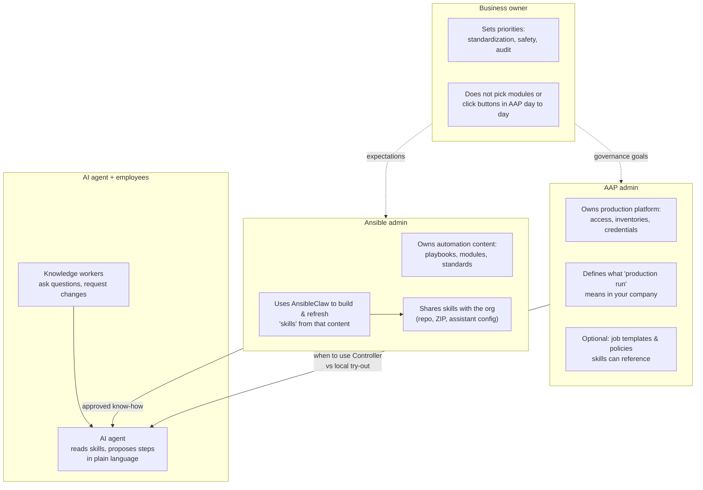
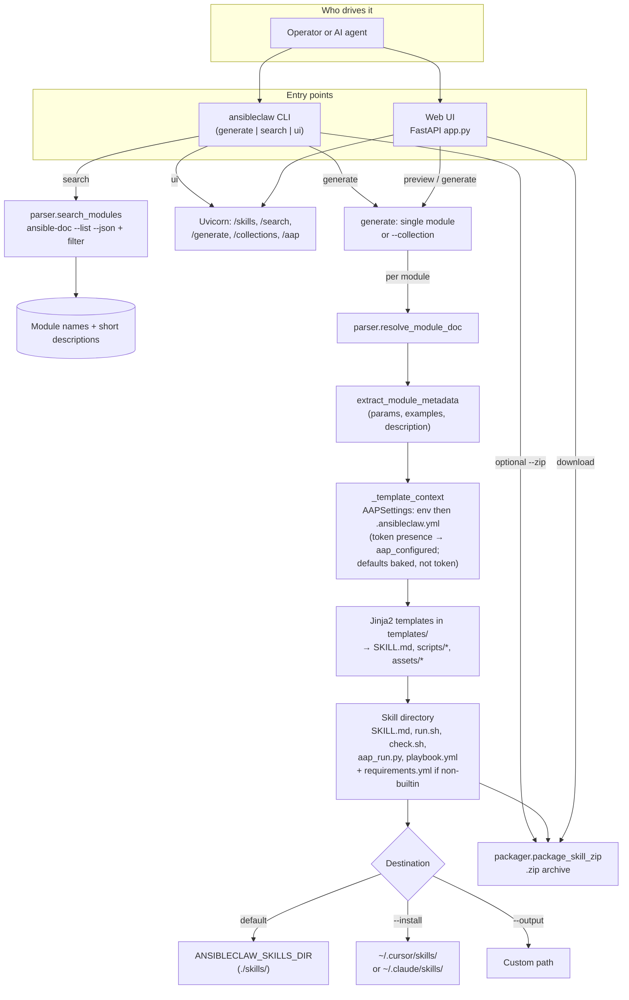
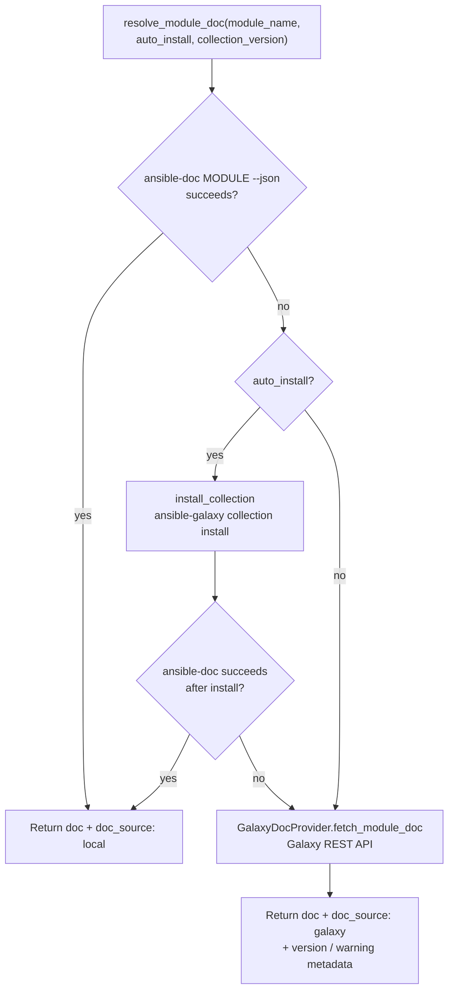
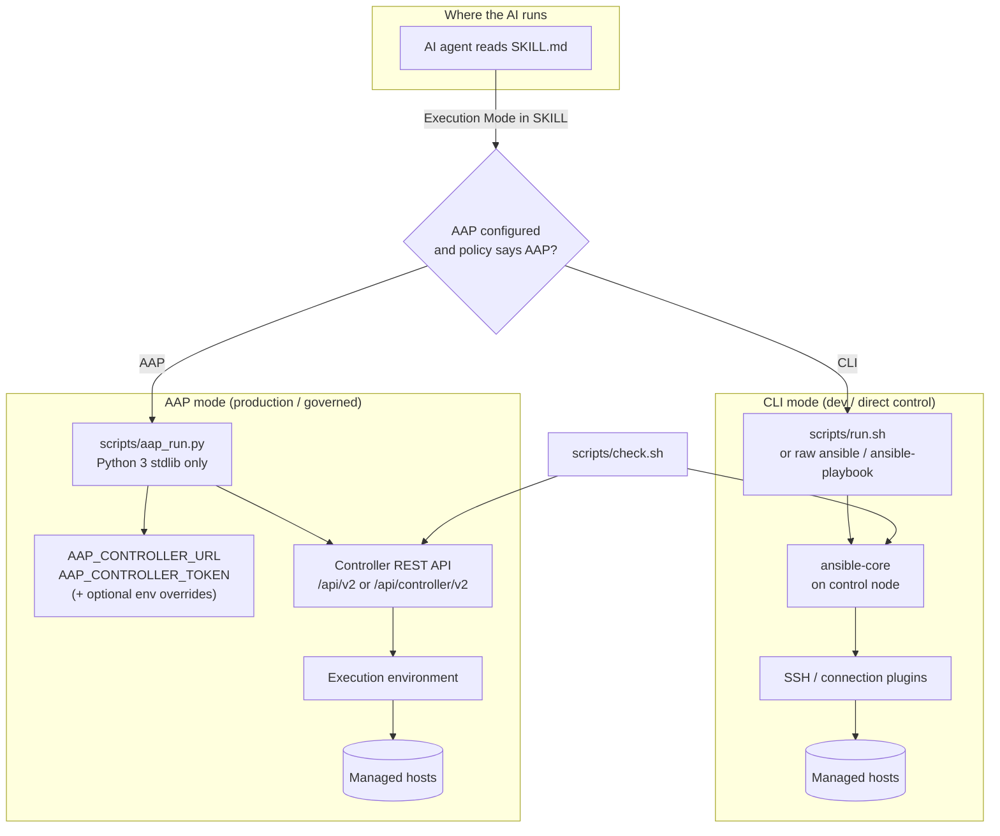
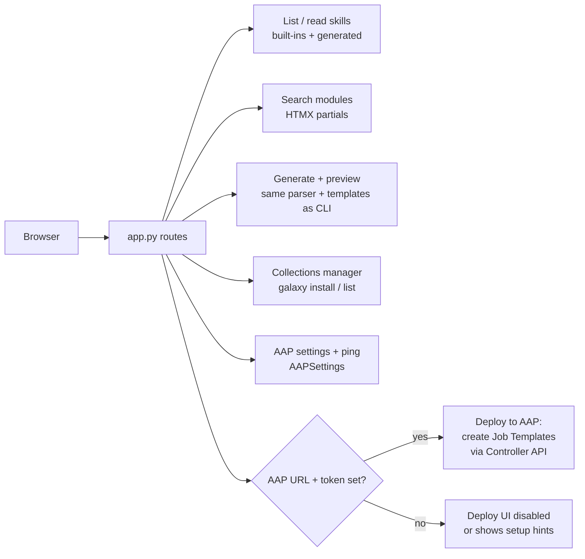

# AnsibleClaw workflow diagrams

**Stakeholder-friendly view:** [Business view: personas and outcomes](#business-view-personas-and-outcomes). **Technical detail:** diagrams further down mirror `src/ansibleclaw/`.

---

## Business view: personas and outcomes

From a **business owner** perspective, the goal is not “run a generator” — it is **faster, safer change** with **clear ownership**: who defines standard work, who governs production, and how everyday questions get answers that match policy.

**AnsibleClaw** sits between **your Ansible practice** and **the AI tools people already use**. It does not replace people or Ansible Automation Platform (AAP); it connects them by packaging **approved automation know-how** into **skills** the **AI agent** is instructed to follow.

### Who is usually in the picture

| Persona | Typical concern | Role with AnsibleClaw |
|--------|-----------------|------------------------|
| **Business owner** | Risk, speed, compliance, cost of mistakes | Sets expectations: production changes must be traceable; experiments may be looser. Does not operate the tools day to day. |
| **Ansible admin** | Correct playbooks, modules, collections, inventory truth | Chooses what to turn into skills, generates and reviews packages, keeps content aligned with how Ansible is actually used. |
| **AAP admin** | Who may run what, on which inventory, with which credentials | Owns Controller setup, RBAC, job templates, audit. Skills can point to AAP for **governed** execution when this role has configured it. |
| **AI agent** | (Product behavior, not a human job title) | Reads skills and responds to users using **your** steps and terminology — not a random web article. |
| **Knowledge worker** | “I need X done on the servers” | Asks in plain language; still subject to the same gates Ansible/AAP admins defined. |

### How the personas connect (one picture)



Solid arrows are **handoffs of rules or content**. Dotted lines are **accountability / expectations**, not file transfers.

### Typical story (sequence)

```mermaid
sequenceDiagram
  participant BO as Business owner
  participant AA as Ansible admin
  participant AAP as AAP admin
  participant KW as Knowledge worker
  participant AI as AI agent

  Note over BO: Fewer ad-hoc fixes; clearer audit for production

  BO->>AA: Prioritize standard tasks (patching, baselines, …)
  BO->>AAP: Governed execution for production

  AA->>AA: Build or update Ansible content
  AA->>AA: Generate skills with AnsibleClaw (review)
  AA->>AI: Publish skills for org-approved guidance

  AAP->>AAP: Inventories, credentials, RBAC, job templates
  Note over AAP: Skills describe when to use Controller

  KW->>AI: Plain-language request (e.g. install X on group Y)
  AI->>KW: Steps from skill (try-out vs AAP per policy)
  Note over KW,AI: Production still follows AAP rules
```

**In one sentence for executives:** AnsibleClaw lets the **Ansible admin** publish **trusted automation guidance** the **AI agent** follows, while the **AAP admin** keeps **production** under **platform control** — so **knowledge workers** move faster without bypassing **how the business said work should be done**.

---

## Technical: entry points to skill package

Diagram below reflects the implementation under `src/ansibleclaw/` (CLI, `core/parser.py`, `core/galaxy.py`, `core/packager.py`, `config.AAPSettings`, and `web/app.py`).



## Module documentation resolution



Collection-wide generation (`ansibleclaw generate --collection`) first calls `list_modules(namespace)`, then runs the same `resolve_module_doc` → `_write_skill_package` path for each selected module. A separate path builds a **collection overview** skill via `collection_skill_template.md` plus `requirements.yml` only (no per-module scripts).

## Runtime: how an agent uses a generated skill



`check.sh` validates `ansible` / inventory assumptions when present and, if `AAP_CONTROLLER_URL` is set, pings the Controller (using `AAP_CONTROLLER_TOKEN` for auth).

## Web dashboard and AAP deploy (optional)



For a concise historical variant of the build vs runtime split, see also [design.md](../design.md) in the repository root.
